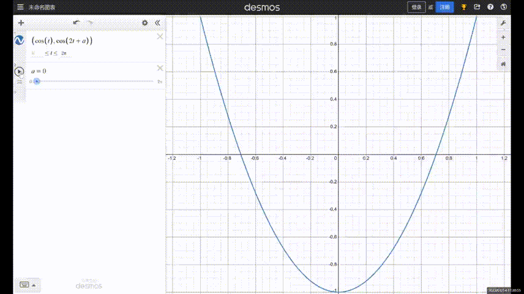
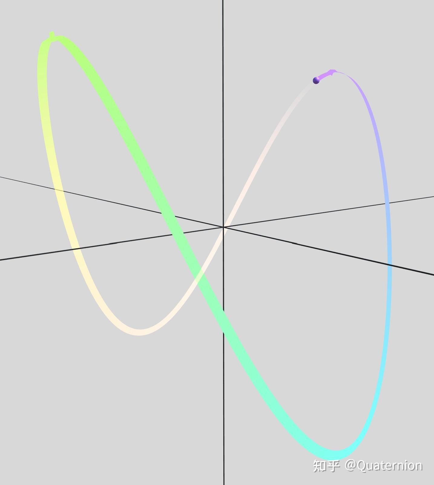
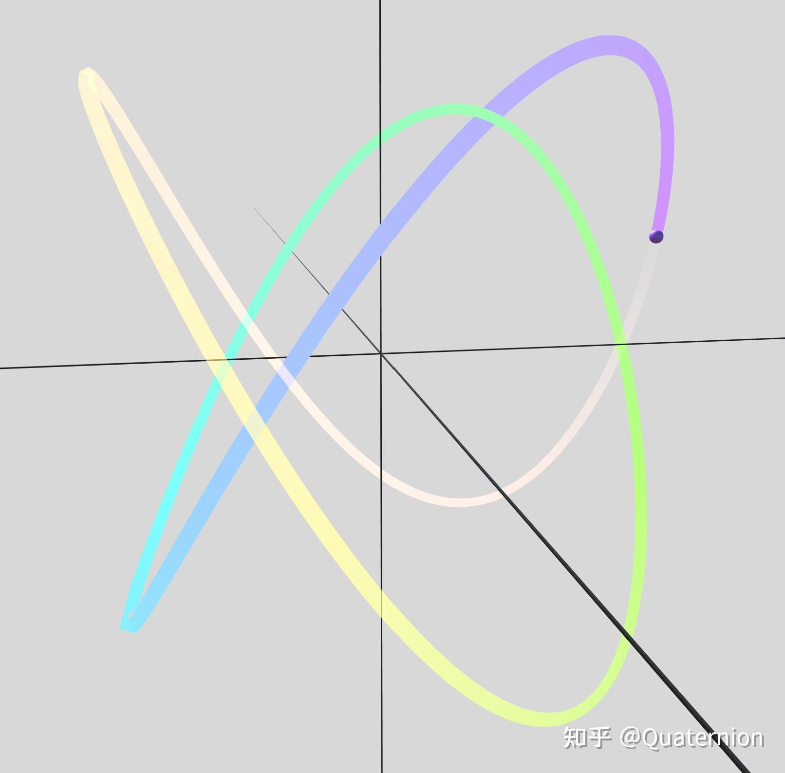
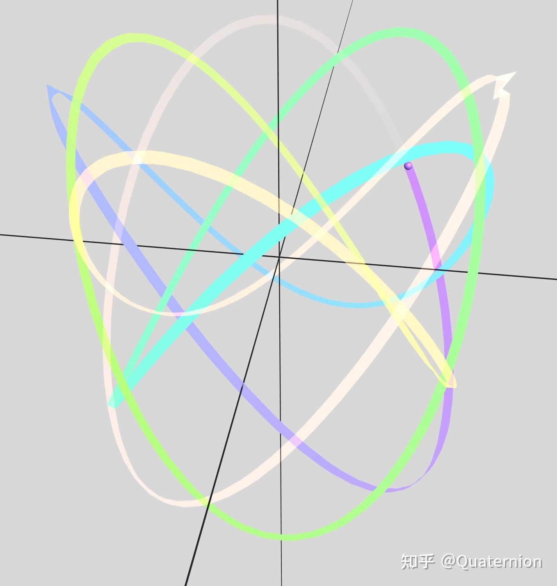
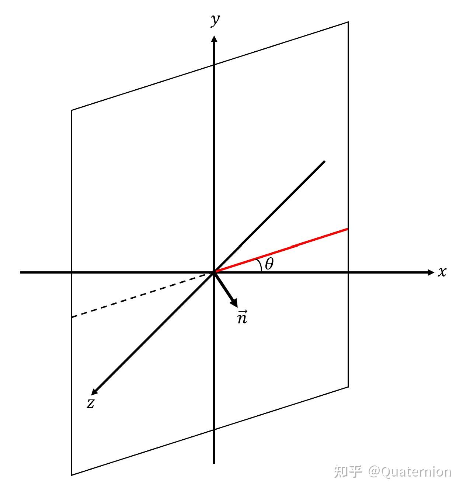
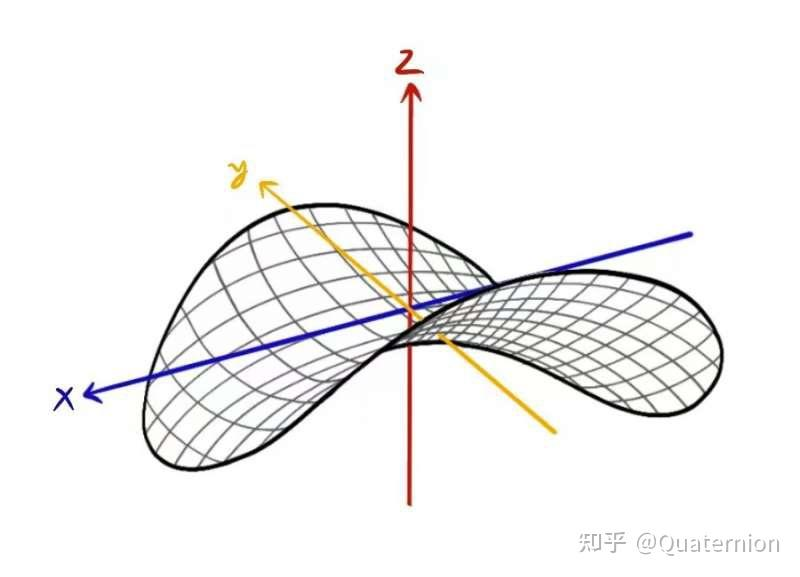

笔者在刚刚结束的这个学期学习了理论力学（力学专业的矢量力学），奈何各种原因（主观犯懒，客观疫情），并没有学得很扎实QAQ。所以我打算趁着寒假时间做一做整理，再好好欣(e)赏(bu)一下理力，为之后的课程做准备。*（结果是硬生生地拖到了暑假的最后……谁来拯救一下拖延症的我@_@）*

今天先聊一聊关于李萨如图形的一些事情。这学期的大作业题目中有一道是关于李萨如图形的，于是我尝试用Unity引擎制作了一个可以演示李萨如图形的小程序。本文的部分内容基于我们的小组报告。关于李萨如图形的概念，我在此就不过多介绍了。本文中的李萨如图形由以下参数方程定义： $x=\cos(\omega_xt)\ ,\\y=\cos(\omega_yt+\varphi)\ .\\$

简单记为 $(\omega_x,\omega_y,\varphi)$ 。

首先引起我们兴趣的是这样一个现象：当参数方程中的 $\varphi$ 发生变化时，图形形状也随之变化，看起来像某一个三维图形在旋转一样。如下图所示：

以上三幅图看起来就好像是观察者位置固定，图形绕 $y$ 轴“旋转”起来一样。我们能否证明当参数方程中的 $\varphi$ 发生变化时，二维李萨如图形的变化确实可以和一个三维图形的旋转等价？由此，我们引进了“三维李萨如图形”的概念。“三维李萨如图形”由以下参数方程定义： $x=\cos(\omega_xt+\varphi_x)\ ,\\y=\cos(\omega_yt+\varphi_y)\ ,\\z=\cos(\omega_zt+\varphi_z)\ .\\$根据观察，我们先提出一些猜测。对于以上几幅图，我的主观感受（有一些小伙伴可能感受与我不同）是：一个三维图形绕着 $y$ 轴旋转，旋转方向为顺时针方向（即 $\vec{\omega}$ 指向 $y$ 轴负半轴；有时也会感觉旋转方向变为逆时针方向，即 $\vec{\omega}$ 指向 $y$ 轴正半轴）。将这个旋转的图形视为刚体，我们盯着刚体上固定的一点（如图形最底部 $y =-1$ 的某一点）看，会感觉到这一点在绕 $y$ 轴做圆周运动。因此，我们推测，这个旋转的三维曲线应由如下的参数方程表示： $x=\cos(\omega_xt)\ ,\\y=\cos(\omega_yt)\ ,\\z=\sin(\omega_xt)\ .\\$

从 $y$ 轴的负半轴向上看（或从 $y$ 轴的正半轴向下看），三维曲线在 $x\text{O}z$ 平面上的投影是一个单位圆，即 $x^2+z^2=1$ ；从 $z$ 轴正半轴向下看，三维曲线在 $x\text{O}y$ 平面上的投影是的二维李萨如图形 $(\omega_x,\omega_y,0)$ 。该三维曲线是 $\varphi_x=\varphi_y=0\ ,\ \varphi_z=-\frac{\pi}{2}$ 的特殊“三维李萨如图形”。利用我制作的小程序，我们先绘制出和上文中三幅图对应的“三维李萨如图形”（图中竖直的轴为 $y$ 轴）：

好像是有一点相似。

接下来我们就来具体证明这种三维李萨如图形的旋转和二维李萨茹图形的相位 $\varphi$ 变化等价。首先，我们需要做一些准备工作。为了消除透视效应（近大远小）的影响，我们需要重新把三维图形投影到某个（包含 $y$ 轴的）二维平面上（仿佛“三维李萨如图形”坠落到了二向箔上）；这时，我们从垂直于旋转轴（即垂直于 $y$ 轴，且观察者的位置在 $x\text{O}z$ 平面内）的方位观察上述三维图形就等价于观察二维平面上的投影曲线。如果命题成立的话，这个平面上的投影曲线应该就是李萨如图形 $(\omega_x,\omega_y,\varphi)$ ，其中 $\varphi$ 由平面的法向量决定。为此，我们需要先证明点在平面上的投影坐标公式。

设平面 $\Omega :Ax+By+Cz+D=0$ ，有不在该平面上的一点 $M(x_0,y_0,z_0)$ ，则有 $Ax_0+By_0+Cz_0+D\ne0$ 。设点 $M $ 在平面 $\Omega$ 上的投影为点 $N(x_1,y_1,z_1)$ ，那么 $\vec{MN}$ 应该与该平面的法向量 $\vec{n}=[A\ B\ C]^\mathrm{T}$ 平行。于是我们可以列出以下方程

$Ax_1+By_1+Cz_1+D=0\\\frac{x_1-x_0}{A}=\frac{y_1-y_0}{B}=\frac{z_1-z_0}{C}\\$解得 $x_1=\frac{1}{A^2+B^2+C^2}[(B^2+C^2)x_0-ABy_0-ACz_0-AD],\\y_1=\frac{1}{A^2+B^2+C^2}[-ABx_0+(A^2+C^2)y_0-BCz_0-BD],\\z_1=\frac{1}{A^2+B^2+C^2}[-ACx_0-BCy_0+(A^2+B^2)z_0-CD].\\$此即点在平面上的投影坐标公式。

有了这个工具之后，我们就可以进一步探索上述三维空间曲线与二维平面曲线之间的关系了。我们已知平面有三个自由度，由于我们已经要求投影平面包含 $y$ 轴（失去了两个自由度），此时平面的空间位置只由一个参数决定。为了后续处理方便，我们不妨把这个参数定为投影平面与 $x\text{O}z$ 平面的交线 $l$ （的一半，即射线）与 $x$ 轴之间的夹角 $\theta$ ，如下图所示：

接着，我们把图形的转动转变为观察者的位置变动。由于运动的相对性，图形旋转而观察者不动可以等价地看作观察者绕着图形旋转，而图形不动。正如下图所示：

于是我们终于可以正式把三维曲线投影到上述的投影平面上了。图示投影平面的单位法向量为 $\vec{n}=(\sin\theta,0,\cos\theta)$ ；对应到点在平面上的投影公式中，可得 $A=\sin\theta,C=\cos\theta,B=D=0$ 。根据前述三维李萨如图形的参数方程，有 $x_0=\cos(\omega_xt)\ ,\\y_0=\cos(\omega_yt)\ ,\\z_0=\sin(\omega_xt)\ ;\\$将以上条件带入到点在平面上的投影公式中，有 $x_1=\cos^2\theta x_0-\sin\theta\cos\theta z_0=\cos^2\theta \cos(\omega_xt)-\sin\theta\cos\theta \sin(\omega_xt),\\y_1=y_0=\cos(\omega_yt),\\z_1=-\sin\theta\cos\theta x_0+\sin^2\theta z_0=-\sin\theta\cos\theta \cos(\omega_xt)+\sin^2\theta \sin(\omega_xt).\\$此即三维曲线在投影平面上投影得到的曲线的参数表达式。可以看到，其形式比较复杂，这是由于投影平面与 $x\text{O}y$ 平面之间存在一个夹角 $\theta$ ，导致得到的投影二维参数曲线有 $z$ 分量。如果我们再把投影平面，连带其上的投影，转到与 $x\text{O}y$ 平面重合，这样就可以得到投影曲线在 $x\text{O}y$ 平面上的表达形式，此时该参数曲线便不含 $z$ 分量了。为此，我们需要用到转轴公式（可以理解为把整个坐标系绕 $y$ 轴转至投影平面与 $x\text{O}y$ 平面重合）： 

$\begin{bmatrix} X\\Z \end{bmatrix}= \begin{bmatrix} \cos\theta & -\sin\theta\\ \sin\theta & \cos\theta \end{bmatrix} \begin{bmatrix} x\\z \end{bmatrix}\\$代入 $x=x_1,z=z_1$ ，计算得到 $X=\cos\theta\cos(\omega_xt)-\sin\theta\sin(\omega_xt)=\cos(\omega_xt+\theta),\\ Y=y_1=\cos(\omega_yt),\\ Z=0.\\$也就是说，把投影曲线放在 $X\text{O}Y$ 平面上，其参数表达形式为 $\begin{matrix} X=\cos(\omega_xt+\theta)\\ Y=\cos(\omega_yt) \end{matrix} \Leftrightarrow \begin{matrix} X=\cos(\omega_x\tilde{t})\\ Y=\cos(\omega_y\tilde{t}-\frac{\omega_y}{\omega_x}\theta) \end{matrix}\\$此即为二维李萨茹图形 $(\omega_x,\omega_y,-\frac{\omega_y}{\omega_x}\theta)$ 。至此，我们证明了前述三维李萨如图形的旋转（等价于投影平面参数 $\theta$ 的改变）和二维李萨茹图形的相位 $\varphi$ 变化等价。

最后再加入一个小彩蛋。我们发现 $\omega_x:\omega_y=1:2$ 的三维李萨茹图形形状很像薯片（暴露了笔者的吃货本质）；从立体几何的角度来说，这种形状可以抽象为双曲抛物面，其曲面方程为 $\frac{x^2}{a^2}-\frac{y^2}{b^2}=2z\\$

对于 $\omega_x:\omega_y=1:2$ 的三维李萨茹图形，其参数方程为 $x=\cos(\omega t),\\ y=\cos(2\omega t),\\ z=\sin(\omega t).\\$经过验证，其满足方程 $x^2-z^2=y$ 。这说明该三维李萨如曲线“吸附在”双曲抛物面上。

完结撒花~

2023年9月8日